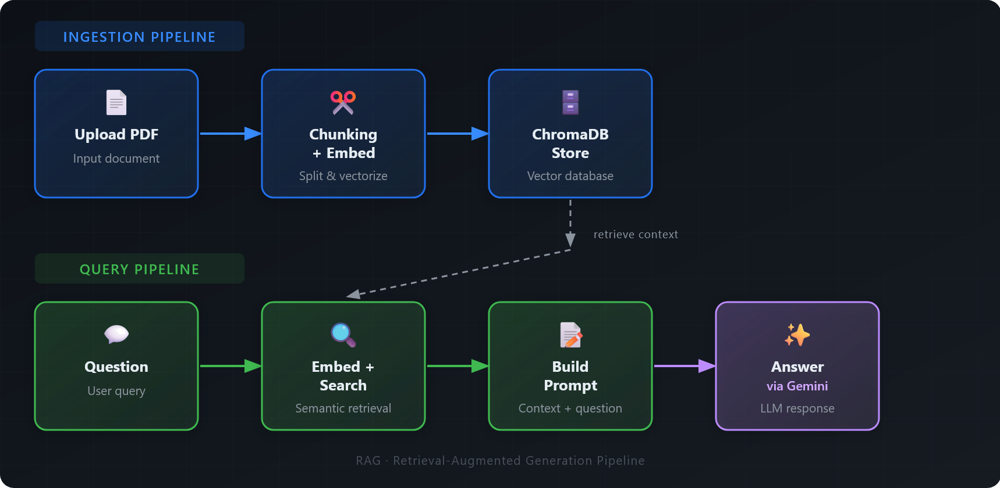

# RAG API

REST API that answers questions based on uploaded documents using Retrieval Augmented Generation.

Built with FastAPI, LangChain, ChromaDB, and Google Gemini.

## Architecture



## Quick Start

### Prerequisites

- Docker and Docker Compose

### Setup

1. Clone the repository:
```bash
git clone https://github.com/seba-blnk/rag-api.git
cd rag-api
```

2. Create a `.env` file with your Google API key:
```bash
GOOGLE_API_KEY=your_api_key_here
```

3. Run with Docker:
```bash
docker-compose up --build
```

The API will be available at `http://localhost:8000`

Interactive docs at `http://localhost:8000/docs`

## API Endpoints

### Upload a document
```bash
curl -X POST http://localhost:8000/upload \
  -F "file=@document.pdf"
```

### Ask a question
```bash
curl -X POST http://localhost:8000/ask \
  -H "Content-Type: application/json" \
  -d '{"question": "What is this document about?"}'
```

### Health check
```bash
curl http://localhost:8000/health
```

### List documents
```bash
curl http://localhost:8000/documents
```

### Delete a specific document
```bash
curl -X DELETE "http://localhost:8000/documents/source?filename=document.pdf"
```

### Delete all documents
```bash
curl -X DELETE http://localhost:8000/documents
```

## Tech Stack

- **FastAPI** - Web framework
- **LangChain** - RAG orchestration
- **ChromaDB** - Vector store
- **Google Gemini** - LLM and embeddings
- **Docker** - Containerization